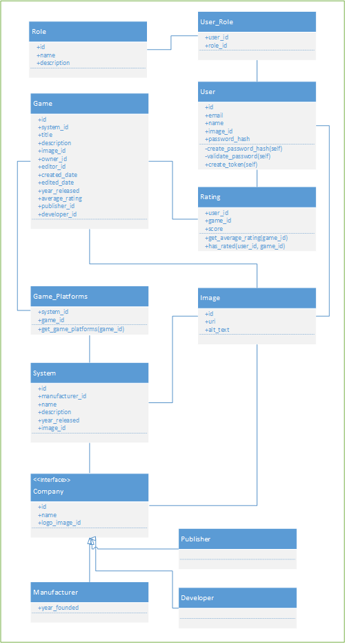

# Game Catalog
Udacity Project to use Python to create a CRUD app using OAuth and API endpoints.

## Description
This is the final project of the Servers, Authorization, and CRUD course in the full stack nanodegree program at Udacity.

The course rubric has the following requirements:
- Does the project implement a JSON endpoint with all required content?
- Does the website read category and item information from a database?
- Does the website include a form allowing users to add new items and correctly processes these forms?
- Does the website include a form to update a record in the database and correctly processes this form?
- Does the website include a way to delete an item from the catalog?
- Do create, delete, and update operations consider authorization status prior to execution?
- Does the website implement a third party authentication and authorization service?
- Is there a “login” and “logout” button/link in the website?
- Is the code ready for personal review and is neatly formatted?
- Are comments present and effectively explain longer code procedures?
- Is there a README file included detailing all steps required to successfully run the application?

My implemetation of the item catolog project is to catalog video games and categorize them by the system they run on and the game publisher and developer.

### Work Item Tracking

I've created my own users stories in the GitHub [issues log](https://github.com/joseph-behrens/game-catalog/issues) using a custom _**Story**_ tag.

### Class Diagram




## Running the Application

The application is hosted at [https://joebehrens.com](https://joebehrens.com) but if you would like to run it on your own you can use the following instructions.

_The below note is not applicable during Udacity review but the keys will be removed and changed after the project is accepted_
~~**The keys required to use OAuth are not included in source control. You will need to provide your own keys and setup your reply URLs within your accounts to use login.**~~

- To run the application locally it's recommended to use Docker:
    1. To install Docker you will first need to download and install for your operating system.  
      a. [Mac](https://docs.docker.com/docker-for-mac/install/)  
      b. [Windows](https://docs.docker.com/docker-for-windows/install/#install-docker-for-windows-desktop-app)  
      c. [Ubuntu](https://docs.docker.com/install/linux/docker-ce/ubuntu/)
    2. If you're running Windows make sure to set Docker to run in [Linux Mode](https://docs.docker.com/docker-for-windows/#switch-between-windows-and-linux-containers). Also, you will need to allow Docker to [access the drive](https://docs.docker.com/docker-for-windows/#shared-drives) where you'll clone this repo.
    3. Clone or download this repo.
    4. Open a command shell and navigate to the folder where you cloned the repo and run `docker-compose up --build`
    5. With the container running you can reach the application in a browser at [http://localhost:5000](http://localhost:5000)
    6. To stop the container press Ctrl+c in the shell and run `docker-compose down`

- Another option is to use Vagrant:
    1. To install Vagrant you will first need to download and install [Virtual Box](https://www.virtualbox.org/wiki/Downloads)
    2. Download and install [Vagrant](https://www.vagrantup.com/downloads.html)
    3. Clone or download this repo.
    4. Open a command shell and navigate to the folder where you cloned the repo and run `vagrant up`  
    This will take a few minutes the first time you run it.
    5. Once the machine is running run `vagrant ssh` from the same directory to log in to the computer.
    6. To run the application from the vagrant ssh session run `python /vagrant/app/views.py`
    7. You can reach the application in a browser at [http://localhost:5000](http://localhost:5000)
    8. To end the application press `Ctrl+c` in the shell and then run `vagrant halt` to stop the virtual machine.
- If you prefer to not use Docker or Vagrant and want to run the application on your own machine:
    1. Download [Python](https://www.python.org/downloads/) and install it onto your own computer.
    2. Clone or download this repository to your computer.
    3. Open a command shell and navigate to the directory you cloned the code into.
    4. This application requires Flask and SqlAlchemy to be installed.
        a. First, ensure [pip](https://pip.pypa.io/en/stable/installing/) is installed  
        b. Then from your command shell in the cloned directory run  
        ```pip install --no-cache-dir -r requirements.txt```  
        This will install of the required Python packages for the application to run.
    5. Run the application using `python views.py`
    6. To end the application press `Ctrl+c` in the shell.
